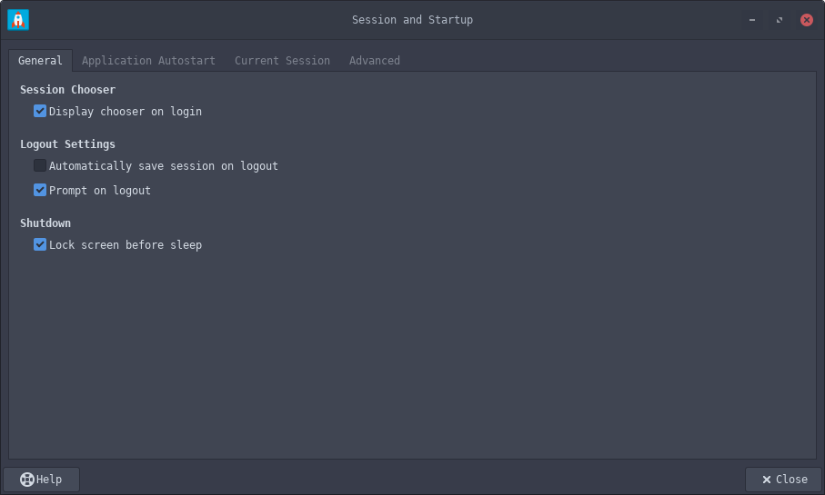

# Using i3 as WM with Xfce4

### Step 1: Installing required packages
Install the following packages if not already installed:
```sh
yay -S xfce4 xfce4-goodies human-icon-theme i3
```


### Step 2: Save the Default session
Login to the Xfce4 session from the login screen. We will first try to save the default version of the session so that if anything goes wrong, we would still be able to use Xfce4 as a normal desktop environment.

Go to `Settings -> Session and Startup`. Now in the `General` tab, select the "Display Session chooser on login" option, and unselect the "Automatically save session on logout" option as shown below:


Go to the `Current Session` tab. Make sure the name of the current active session is something like "Default".


Click on the `Save session` button. Now go to the "Saved Sessions" tab to make sure that the current session is saved. It should look something like this:


### Step 3: Create a new session
At the time of writing this document, I couldn't find any other easier way to create a new session. That is why I have chosen the "Display Session chooser on login" option in the previous step.
Now logout from the current session, making sure that you don't click on the "Save current session" in the logout options.
Once logged out, log in again in the xfce4 session. This time, it will give you a dialog box asking you to choose the session you want to start as shown below:


Click on the "+" button, enter the name of the new session and login. I have used the session name as "xfce4-i3".
Once logged in, go to `Settings -> Session and Startup -> Current Session` to make sure that you are in the newer session (i.e., xfce4-i3 session) now.


### Step 4: Changing Xfce4 settings to start i3
The first thing we need to do is to disable the start-up applications `xfwm4` and `xfdesktop`. Choose "Never" as their Restart Style as shown below:


Next, go to the `Application Autostart` tab, and add the `i3` command using the Add button. Keep the name as you seem fit, and add this at the following command:
```sh
i3 -c /home/mrinaal/.config/i3/config_xfce4
```


Select the newly added command to enable autostart. Now go to the `Current Session` tab and click on the save session button. The `xfce4-i3` should appear in the `Saved Sessions`.


### Step 5: Trying out the new session
Everything is set now. Logout from the current session (remember to ensure that the save session is not selected in the logout screen). Once you log back in, choose the `xfce4-i3` session from the list and you are good to go.


### Other details:
- At the time of writing this document, the `lightdm` desktop manager was used which provided the login screen application.
- To change the wallpaper, copy the image file in `/usr/share/backgrounds/` and use the `Default` XFCE4 session to update the wallpaper both in `nitrogen` as well as in xfce4 settings GUI. Once done, you need to save the default session again for changes to take affect across i3 session as well.


### References
- [Easy Setup: Endeavour XFCE + i3 tiling window manager](https://forum.endeavouros.com/t/tutorial-easy-setup-endeavour-xfce-i3-tiling-window-manager/13171)
- [Xubuntu with i3 Tiling Windows Walkthrough](https://feeblenerd.blogspot.com/2015/11/pretty-i3-with-xfce.html)
